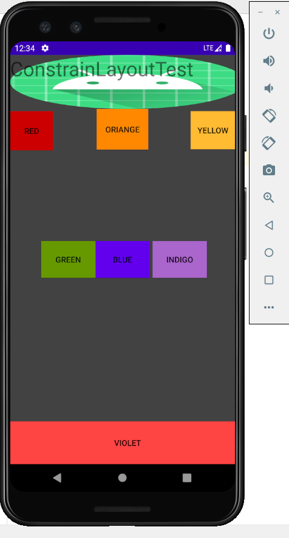

 Android界面布局实验
 
 一、实验目的
 
     1.学习Android的界面布局方式。
  
     2.学习线性布局，约束性布局和表格布局
  
 二、实验内容
 
     1.学习使用线性布局。
     
     2.学习使用ConstraintLayout。
     
     3.学习使用表格布局。
   
 三、实验步骤
 
     1.学习老师提供的资料。
     
     2.根据实验要求针对性查找资料。
     
     3.完成实验内容。
     
     4.编写（readme）实验报告。
     
 四、实验结果
 
     1.线性布局
     
     
     
     
     
     2.约束性布局（ConstraintLayout）
     
     
     
     
     
     3.表格布局
     
     
     
     
